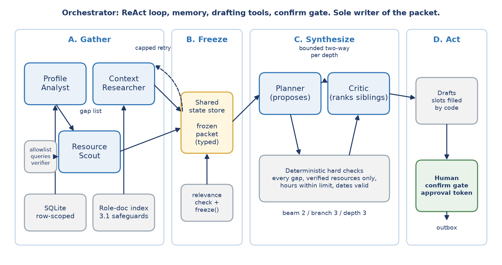
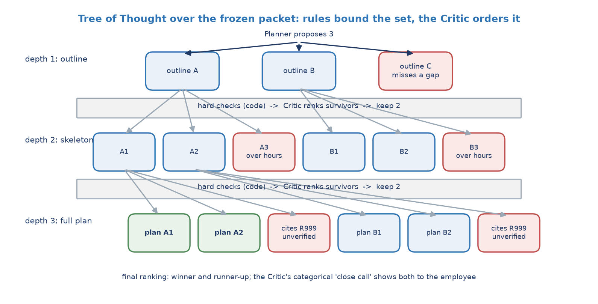

# Professional Development Assistant (PDA)

A multi-agent personal assistant that builds a grounded, verified, approval-gated development plan for one employee at a consulting firm. It reads the employee's skill and certification data, retrieves the role's competency documents, finds learning resources, synthesizes a plan with a Tree-of-Thought beam search, and drafts actions (a renewal reminder, calendar blocks, a note) that execute only after a person approves them. Every guardrail is enforced somewhere the model cannot reach: a database scope, a closed schema, a code-filled template slot, a token checked by a separate function.

Capstone project for the CMU Agentic AI Program, by Igor Alcantara. Plain Python calling the Anthropic API directly; no agent framework. All data is synthetic.

Presentation video (about 9 minutes): https://youtu.be/fSw6erJiq3c



## The four phases

**A. Gather.** The Orchestrator runs a ReAct loop with a small typed action space. It sends the Profile Analyst to the warehouse (SQLite here, standing in for Snowflake) through a row-scoped, read-only connection; gap deltas are computed in code. It sends the Context Researcher to the internal role-document index, where every query passes a metadata precondition, a role filter, a per-query relevance check, and only then a coarse similarity floor. Once the gap list exists, the Resource Scout searches the resource catalog (standing in for web search) with queries assembled from an allowlisted taxonomy, and returns typed records that have been verified by fetching their URL and matching the title. If a step fails, the loop reads that in its Observation and retries once.

**B. Freeze.** The context packet is sealed in the shared state store and hashed. Escalation rules run: missing or conflicting role documents, a stale snapshot, a retry cap, and a deliberately loose classifier for performance, promotion, compensation, and accommodation topics.

**C. Synthesize.** A Tree-of-Thought search with beam width 2, branching factor 3, depth 3 (outline, skeleton, full plan). At each depth the Planner proposes, deterministic hard checks reject in code (every gap addressed, only verified resources cited, weekly hours within the employee's limit, schedule within 26 weeks), and the Critic ranks the survivors against each other. The Critic never scores in isolation; its one categorical verdict, "clear win" or "close call", decides whether the employee sees one plan or two.

**D. Act.** Drafts are templates; every date and credit count is copied into a slot by code from the typed source. The CLI shows each draft and asks for approval. A "yes" issues a random token that only the executing function checks. Execution writes to `outbox/`, which is honest about being a simulation.



## Quickstart

```bash
git clone https://github.com/igor-alcantara/cmu-agentic-capstone-pda.git
cd cmu-agentic-capstone-pda
python -m venv .venv
.venv/Scripts/activate            # Windows. macOS/Linux: source .venv/bin/activate
pip install -r requirements.txt
python -m pda.cli --employee E007 --mock
```

That runs the whole system against a deterministic mock model, with no key and no network, and takes under a second. You will see the ReAct trace (including the scripted failure and retry), the escalations, the chosen plan and its runner-up, and an approval prompt per drafted action. Approved actions land in `outbox/`; rejections are remembered in `data/memory/E007.json` so they are not proposed the same way again.

Other employees worth trying: `E011` (no role document, labeled fallback), `E010` (conflicting role documents, escalates to L&D), `E005` (asks about promotion, classifier fires), `E012` (2 hours a week, the planner has to trim). Add `--today 2026-12-01` to any run to see the stale-snapshot escalation.

**Real mode.** Copy `.env.example` to `.env`, set `ANTHROPIC_API_KEY`, and drop `--mock`. The default model is `claude-sonnet-5`; change `PDA_MODEL` to use another. Real mode makes roughly 30 short calls per run. Never commit `.env`.

**Headless.** `--auto-approve-none` leaves every action as a draft, which is how the evaluation runs.

## Tests and evaluation

```bash
pytest -q                          # 48 tests, mock mode, no key
python eval/run_eval.py            # writes eval/results/results.json and results.md
python eval/run_eval.py --real     # adds a real-model E007 run and Critic pairs (needs a key)
python data/build_synthetic.py     # regenerates all synthetic data (seed 42) and resets memory
```

Each guardrail has a test named for the failure it removes, for example `test_forged_approval_token_rejected` and `test_injection_string_never_reaches_orchestrator_prompt` in `tests/test_guardrails.py`.

## Guardrails: what fails without them, and where each one lives

| Failure removed | Mechanism | Where enforced |
|---|---|---|
| Reading another employee's rows | Row-scoped read-only connection; SQL must filter on the injected id, literal ids are refused | `pda/guardrails/scoped_db.py`, outside the model |
| Model free-typing an external search query | Queries composed from allowlisted taxonomy terms; off-taxonomy terms raise | `pda/guardrails/query_builder.py` |
| Prompt injection through fetched text | The only agent that reads untrusted text has no other capability; it returns a typed `Resource` with no description field, and the packet renderer emits typed fields only | `pda/models.py` (closed schema), `pda/prompts.py` (renderer), `pda/agents/resource_scout.py` |
| Fabricated or misattributed resource | Fetch the claimed URL and match the title; unverified claims dropped and counted | `pda/guardrails/verifier.py` |
| A date or credit count regenerated wrong | Template slots filled by code from typed objects; unfilled placeholders raise | `pda/guardrails/slots.py`, `pda/drafting.py` |
| Advice touching rating or pay | No field exists for either; schemas are closed (`extra="forbid"`) | `pda/models.py` |
| Action executing because the model said so | Two phases: drafts are free, execution needs a token issued from a `HumanConfirmation` the CLI creates, checked by a function the model cannot call | `pda/guardrails/approvals.py`, `pda/drafting.py` |
| Runaway loop or silent cap | Tool-call, token, and wall-clock caps charged at the LLM boundary; a cap yields a labeled partial plan | `pda/guardrails/budget.py`, `pda/llm.py` |
| Confident wrong retrieval | Metadata precondition, role filter, per-query relevance check; similarity is a coarse floor only | `pda/retrieval/safeguards.py` |
| A fixed cutoff pruning good plans | Hard constraints in code, then relative ranking (beam keep-top-2); the only absolute floor catches empty output | `pda/tot.py`, `pda/agents/critic.py` |
| Model freezing or acting out of phase | The allowed action list at each step is computed by code from what has actually reported | `pda/orchestrator.py` |

## Evaluation summary

From `eval/results/results.md`, mock mode, 12 employees, every number with its denominator:

| Metric | Result |
|---|---|
| Field exactness (dates and credit counts in drafts vs database) | 29/29 |
| Resource validity (cited resources re-verified) | 53/53 |
| Groundedness checker vs 22 labeled claims | 22/22 |
| Retrieval precision@8, raw similarity, no metadata filter | 132/264 = 0.50 |
| Retrieval precision of passages kept after the safeguards | 66/75 = 0.88 |
| Gap coverage in packet and in winning plan | 33/33 and 33/33 |
| Missed escalations / unnecessary escalations (15 labeled cases) | 0/9 and 1/6 (the one is an accepted false positive) |
| Injection strings reaching an acting agent's prompt | 0/204 |
| Critic rank correlation vs human labels | pending human labels |
| Fallback rate | 2/12 (the two employees built to trigger it) |

Two things the numbers say plainly. The retrieval safeguards raise precision from 0.50 to 0.88 over raw similarity, which is the checkpoint 3.1 lesson measured. And four poisoned catalog entries reached packets as typed records and one was even cited by a plan, while zero injection strings reached any acting prompt: the defense is capability separation, not filtering, and the eval shows exactly that. The mock-mode Critic is a keyword stand-in, so its "close call" rate and pair rankings are not meaningful until the real-mode run and the human labels are in.

## Repository map

```
pda/
  cli.py                 entry point with the approve/reject prompt
  orchestrator.py        ReAct loop; phase order enforced in code; JSONL run log; long-term memory
  tot.py                 beam search: hard checks in code, then the Critic ranks survivors
  drafting.py            template drafts with code-filled slots; execute() runs only with a token
  escalation.py          categorical, deterministic, classifier, and judgment triggers
  state.py               shared state store with freeze() and the run log
  models.py              typed payloads (closed schemas)
  prompts.py             every prompt sent to a model, plus the typed-only packet renderer
  llm.py                 Anthropic client wrapper and the deterministic MockLLM, both budget-charged
  mock_handlers.py       per-task stand-ins for keyless runs
  config.py              caps, beam parameters, model, paths
  agents/                profile_analyst, context_researcher, resource_scout, planner, critic
  guardrails/            scoped_db, query_builder, verifier, slots, approvals, budget
  retrieval/             TF-IDF index over role docs; the 3.1 safeguards
data/
  build_synthetic.py     seeded generator for everything below
  pda.db                 SQLite (employees, skills, certifications, taxonomy, role requirements, snapshot)
  role_docs/             13 role and competency documents with frontmatter
  resource_catalog.json  88 learning resources, 5 with injection strings in their descriptions
  memory/                long-term memory per employee
eval/
  run_eval.py            the harness
  labeled/               22 groundedness claims, 15 escalation cases, 10 critic pairs
  results/               results.json and results.md (committed)
examples/
  sample_run_E007.md     the ReAct trace and tree search of one run, typed payloads only
  sample_plan_E007.md    the rendered packet, both final plans, and the three drafts
tests/                   48 tests; each guardrail test is named for the failure it removes
docs/                    the two figures and the script that draws them
```

## Data statement

Everything under `data/` is synthetic and regenerated by `data/build_synthetic.py --seed 42`. Employee names are invented, except that the demo employee E007 carries the author's own name over an invented profile; no IPC Global employee data, document, or resource appears. The role documents and catalog were written for this build. Five catalog entries carry prompt-injection text on purpose, and one employee has no role document and another has two conflicting ones, so that the fallbacks and escalations can be demonstrated rather than described.

## Limitations

Synthetic corpus; a catalog instead of live search; execution simulated to an outbox; TF-IDF retrieval; a keyword stand-in for the model in mock mode, including the relevance check and the Critic; Critic validation pending human labels; single-session scale. One residual risk survives every layer: a plan that is grounded, verified, in policy, and still poor advice. Nothing deterministic catches that, which is why the human approval gate is not removable.

## License

MIT.
